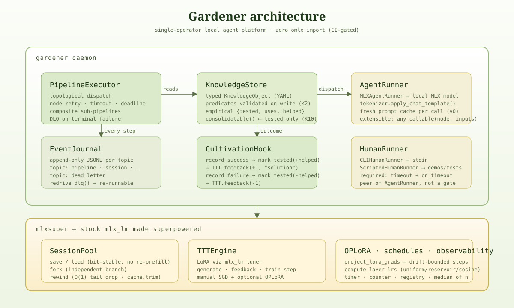

<p align="center">
  
</p>

# Gardener

**A place to grow long-running agents on your own hardware.**

[](LICENSE)
[](https://www.python.org/)
[](#)
[](#status)
[](#)

Gardener is a single-operator, **local** agent platform for Apple Silicon. You scaffold an agent with one command, give it a system prompt and some knowledge, then ask it questions or compose it with other agents into pipelines — all from a `gardener` CLI. Underneath, it runs everything on a stock `mlx-lm` install plus the *hypercar-class* superpowers we ported in: bit-stable session fork/save/load, 3-bit and dual-tier KV caches, SnapKV eviction, adaptive prefill, and a TTT sleep cycle bounded by an OPLoRA promote gate.

There is **no cloud-API fallback** — by design, and CI-enforced.

---

## Install

Requires macOS on Apple Silicon (M-series), Python 3.13+, and ~300 MB for the test model.

```bash
git clone git@github.com:terraboops/gardener.git
cd gardener
python3 -m venv .venv
.venv/bin/pip install -e ".[dev]"
```

This makes a `gardener` executable available inside the venv.

```bash
.venv/bin/gardener --help
```

---

## Quickstart — your first agent

```bash
# Scaffold an agent
.venv/bin/gardener init my-coder

# Edit its system prompt (the wizard does this interactively; init creates a stub)
$EDITOR ./my-coder/prompt.md

# Ask it something — first call downloads ~300 MB Qwen2.5-0.5B-Instruct-4bit
.venv/bin/gardener query my-coder "How do I reverse a Python list?"

# Record what worked
.venv/bin/gardener update my-coder "lst[::-1] — slice with step -1"

# See what's registered
.venv/bin/gardener list
```

Want a guided setup with model picker + drafted system prompt?

```bash
.venv/bin/gardener wizard
```

It asks for name, purpose, model, temperature, optional seed knowledge — then scaffolds the directory and registers it.

---

## Stitch agents together with pipelines

Agents talk to each other through **pipelines** — composable DAGs written in either YAML or a prose DSL.

Create `pipelines/duet.prose`:

```
pipeline duet:
  deadline 60.0

  agent planner:
    prompt: "Break the user's task into 2-3 steps."
    max_tokens: 200

  agent executor:
    prompt: "Execute the plan precisely. Output the result only."
    max_tokens: 300
    input plan from planner

  human review:
    ask: "Approve the result?"
    timeout: 60.0
    on_timeout: dead-letter
    input result from executor
```

Then:

```bash
.venv/bin/gardener init planner
.venv/bin/gardener init executor
# (edit each prompt.md to match its role)

.venv/bin/gardener swarm pipelines/duet.prose \
    --inputs '{"planner":"reverse a Python list in-place"}' \
    --journal-root ./runs/duet
```

The scheduler dispatches each node, models load once and cache, the human node blocks for your approval, and the journal records every step. If anything fails its retry budget, it lands in the dead-letter queue (durable, re-drivable) — the pipeline always ends in a *consistent* terminal state (`succeeded`, `timed_out`, or `completed_with_dead_letters`), never an ambiguous hang.

Watch what's happening:

```bash
.venv/bin/gardener observe my-coder --follow     # tail this agent's journal
```

---

## Pre-load contexts on disk (the warm-cache superpower)

Heavy system prompts and reference text take real prefill time. Save them once, fork-per-call on every subsequent invocation:

```bash
# Warm a cache from the agent's prompt.md
.venv/bin/gardener cache warm my-coder --use-prompt-md --name persona

# Or from a file
.venv/bin/gardener cache warm my-coder --file ./docs/codebase-overview.md --name repo

# Or inline
.venv/bin/gardener cache warm my-coder --text "You always cite line numbers." --name terse

# See what's warm
.venv/bin/gardener cache list my-coder

# Use one for a one-shot — much faster than cold
.venv/bin/gardener cache use my-coder persona "What is a list comprehension?"

# Tidy up
.venv/bin/gardener cache rm my-coder persona
```

Each cache is a `.safetensors` file in `<agent>/cache/`. On `use` the cache is loaded, the session is **forked** (the bit-stable independent-branch primitive ported from hypercar's TQ3 cache), then the fork is discarded after the call — your warm context is never mutated.

---

## CLI reference

```
gardener init NAME [--path PATH] [--model HF_ID] [--force]
gardener wizard [--inline KEY=VAL ...] [--yes]
gardener list
gardener query NAME-OR-PATH "QUESTION" [--max-tokens N] [--temperature T]
gardener update NAME-OR-PATH "NOTE"
gardener remove NAME

gardener swarm PIPELINE.prose [--agent NAME ...] [--inputs JSON]
                              [--journal-root DIR] [--max-concurrent N]
                              [--priority P] [--timeout S]
gardener observe NAME-OR-PATH [--topic TOPIC] [--follow] [-n N]

gardener cache warm   NAME [--text TEXT | --file FILE | --use-prompt-md] [--name NAME]
gardener cache list   NAME
gardener cache rm     NAME CACHE-NAME
gardener cache use    NAME CACHE-NAME "QUESTION"
```

Every command honors `$GARDENER_REGISTRY` (default `~/.gardener/registry.json`) so you can keep separate registries for separate projects.

---

## Agent directory layout

`gardener init <name>` scaffolds:

```
<agent>/
  agent.yaml         # name, model, temperature, max_tokens, draft_model, ...
  prompt.md          # the system prompt (Markdown, multi-line, edit freely)
  knowledge/         # per-agent KnowledgeStore (typed .yaml KnowledgeObjects)
  journal/           # per-agent EventJournal (JSONL topics + DLQ)
  cache/             # warm context caches (gardener cache warm)
  pipelines/         # optional .prose pipelines this agent ships with
```

A top-level `~/.gardener/registry.json` (or whatever `$GARDENER_REGISTRY` points at) maps short names → absolute paths, so `gardener query my-coder` resolves the same way `autonav` does for navigators.

---

## Philosophy

Gardener is built on the **Software Garden** doctrine — *agents are coworkers, not machines. You cultivate the conditions for growth; you don't command execution.* Three commitments ripple through the design:

1. **Pipelines guarantee they end.** Acyclic graphs, bounded retry, per-node timeouts, and a required pipeline `deadline` — together with a **dead-letter queue** — make "runs forever" structurally unrepresentable and "silently lost work" impossible.
2. **Human and agent work are equal first-class citizens.** A `human` node has typed inputs/outputs, routing, journal, and a required timeout policy — exactly like an `agent` node. Agents delegate to humans as peers, not as approval gates.
3. **Knowledge must be tested before it's consolidated.** Every `KnowledgeObject` carries an `empirical` field. Only entries an execution or a human has *validated* are eligible for the slow-tier learning loop (the TTT/OPLoRA sleep cycle) that actually updates LoRA weights.

---

## Under the hood

### 🧠 `mlxsuper` — stock `mlx-lm` made superpowered

A thin layer of capabilities every Gardener agent uses, ported (never imported) from the hypercar research. CI gate ensures `gardener/` contains zero `omlx` imports.

| Module | What it gives you |
|---|---|
| `SessionPool` | Named KV-cache sessions. `save` / `load` (bit-stable resume, no re-prefill), `fork` (independent branch), `rewind` (O(1) tail drop). |
| `DuoKVCache` | fp16 streaming + 3-bit retrieval per head. ~20× memory savings at 256K context. The best-quality default mode. |
| `TurboQuantKVCache` | 3-bit KV with WHT rotation + Beta codebook + agentic save/load/fork. The mode that gives you durable session checkpoints. |
| `snapkv_select` + `compact_cache` | 8-layer attention-guided eviction stack. Validated to 128K upstream. |
| `apply_adaptive_prefill` | 512K-validated memory-aware chunk controller. |
| `apply_prefill_last_logit_patch` | Cuts the (seq_len, vocab) logits tensor for >8K context — saves ~40 GB at 128K. |
| `TTTEngine` + `oplora` | Test-time training with orthogonal-projection LoRA gradient projection. The cultivation-loop substrate. |
| `SleepCycle` | Bit-equivalence promote gate: snapshot held-out probe → train → measure drift → promote-or-rewind. |
| `apply_minference_prefill_patch` | Per-(layer, head) sparse prefill — **opt-in**; shipped calibration table is a synthetic placeholder pending a real run of `scripts/minference_calibrate.py`. |
| `hybrid.attention_layer_indices` + `format_chat` | Hybrid-model helpers (enables Qwen3.6, the 512K-validated model). |

### 🧩 Pipelines as composable DAGs

Pipelines are typed graphs validated against a strict IR. Three node kinds — all equal graph citizens, all carrying typed inputs/outputs and the same edge/journal/round-trip treatment:

- **`agent`** — runs through an `AgentRunner`. Default is `MLXAgentRunner` (local MLX). Swappable; the `tools:` field in `agent.yaml` is reserved for the upcoming tool registry.
- **`human`** — delegates work to a human via a `HumanRunner` (`CLIHumanRunner` for stdin, `ScriptedHumanRunner` for demos/tests). `timeout` + `on_timeout` are compile-time required.
- **`composite`** — a bounded sub-pipeline. The escape hatch for multi-node feedback loops (implement → validate → fix) without ever drawing a back-edge in the outer graph.

The validator rejects cycles, missing deadlines, unresolved inputs, and human nodes without timeouts — with a *located* error, never a silent `{}`.

### 📓 Journal + Dead-Letter Queue

Append-only JSONL per topic. Every pipeline event is durable and replayable. Terminal failures route to a `dead_letter` topic that's inspectable and **re-drivable** (no silently-dropped work).

### 🌾 Knowledge with an empirical-feedback gate

Per-agent `KnowledgeStore` of typed `KnowledgeObject`s. Predicates strictly validated on write — malformed triples are *loudly rejected*. Every object has an `empirical` field; `consolidatable()` only yields entries with `empirical.tested=True`. That's what gates the slow-tier learning cycle from consuming untested noise.

`gardener update <agent> "note"` records a note. The sleep cycle and human approval are what flip `tested=True`.

### 🔄 Cultivation loop (the loop closer)

`CultivationHook` bridges outcomes back: agent success marks the relevant knowledge as `tested=True helped+=1` *and* feeds a `TTTEngine` a positive reward. Failure does the opposite. The sleep cycle (`gardener.sleep.SleepCycle`) periodically trains over tested knowledge with OPLoRA-projected gradients, then promotes-or-rewinds based on held-out drift.

---

## Architecture

<p align="center">
  
</p>

---

## Running hypercar-class — switching to a real model

The default test model (`Qwen2.5-0.5B-Instruct-4bit`, ~300 MB) is great for testing the platform but doesn't exercise the hypercar-class features at their intended scale. They were validated upstream on **`mlx-community/Qwen3.6-35B-A3B-4bit`** (~20 GB; needs M4 Pro 48 GB).

```bash
# Scaffold an agent that uses the 35B hybrid model
.venv/bin/gardener init big-coder --model mlx-community/Qwen3.6-35B-A3B-4bit
.venv/bin/gardener query big-coder "Explain Rayleigh scattering in one sentence."
```

For the full hypercar bench harness:

```bash
.venv/bin/python -m gardener.bench.cli \
    --model mlx-community/Qwen3.6-35B-A3B-4bit \
    --phases smoke,coherence,decode_speed,prefill_speed,memory_profile,humaneval_lite,mmlu_pro,ruler,livecodebench \
    --n 3 --out /tmp/run.json
```

Or the one-command validation against hypercar's 6 goals:

```bash
.venv/bin/python scripts/validate_hypercar_goals.py \
    --model mlx-community/Qwen3.6-35B-A3B-4bit
```

That produces a Markdown report at `docs/validation-YYYY-MM-DD-<model>.md` with per-goal pass/fail and swap-mode-stratified numbers. **A full run is several hours wall-time on a 35B model** — overnight territory.

`MInference (HX6)` sparse prefill is **opt-in** — the shipped calibration table is a synthetic placeholder. To get the 32K+ prefill speedup, run `scripts/minference_calibrate.py --model <id>` first.

---

## Status

This is a **v0 prototype** — small end-to-end vertical exercising the whole architecture. The pieces are real and tested.

| In v0 ✅ | Deferred 📋 |
|---|---|
| `gardener` CLI (init/list/wizard/query/update/remove/swarm/observe/cache) | `gardener run <agent>` — autonomous daemon loop (R1) |
| mlxsuper core (sessions, TTT, OPLoRA, schedules, observability) | Tool registry (file/web/exec) — `tools:` field reserved (R2) |
| Composable-DAG pipeline IR + YAML loader + prose DSL + executor | Inter-agent dispatch within pipelines (R3) |
| Journal + DLQ + re-drive | Periodic knowledge curation + scheduled sleep (R4) |
| Knowledge store hardened (K1–K10) | TUI dashboard (R5) |
| TTT sleep cycle + bit-equivalence promote gate | Pi RPC harness adapter (R6) |
| Priority-queue scheduler + cadence triggers (lite) | Real hypercar-goal validation run on Qwen3.6 (S1) |
| Block-pool pre-cached subagents (via `gardener cache`) | MInference real calibration (S2) |
| Cultivation hook wiring | Speculative-decoding α probe (S3) |
| Bidirectional human↔agent (`human` node kind) | Chattermax-style event spine — multi-machine (T1) |
| HX-tier hypercar capability ports (DuoKV, TQ3, SnapKV, adaptive prefill, prefill-last-logit, MInference, hybrid, TTT router, spec-decode) | Hermes-style chat transports (Discord/Slack) (T2) |
| Slim hypercar-style bench harness | Chalet-style human-projection UI (T3) |
| 4 model-quality gates (HumanEval / MMLU-Pro / RULER / LiveCodeBench) | Full TLA+-verified trellis pool lift |
| `validate_hypercar_goals.py` one-command validation | TTT-Linear Cycle 2 (upstream-pending) |

See [`gardener/docs/design.md`](gardener/docs/design.md) for the full design and [`docs/plans/`](docs/plans/) for the phase-by-phase plans.

---

## Tests

```bash
# Fast unit tests (no model load):
.venv/bin/python -m pytest -m "not model"

# Model integration tests (loads Qwen2.5-0.5B):
.venv/bin/python -m pytest -m model

# CI gate (must always pass — repo is port-not-depend):
.venv/bin/python scripts/check_no_omlx_import.py
```

Current: **252 fast + 32 model tests passing** (1 xfail documenting an upstream mlx/mlx_lm `quantized_matmul` signature drift — see `tests/test_turboquant_kv.py`).

---

## For library users

If you'd rather skip the CLI and use Gardener as a Python library, the [`examples/`](examples/) directory has two starter scripts:

- `examples/demo_simple_agent.py` — the smallest end-to-end (one agent, one human approval, one knowledge object).
- `examples/demo_full.py` — exercises the MVP+ stack (prose pipeline + scheduler + pre-cached subagent + sleep cycle).

Both are ~50 lines; they're the right entry point if you want to read the substrate before writing your own integration.

---

## Contributing

Issues and PRs welcome. By contributing, you agree your contributions are licensed under the same AGPL-3.0 as the project. If you're planning a non-trivial change, please open an issue first so we can align on direction.

---

## License

[GNU Affero General Public License v3.0](LICENSE). Strong copyleft + network-use clause — if you run a modified Gardener as a hosted service that users interact with over a network, you must offer source under the same terms.
